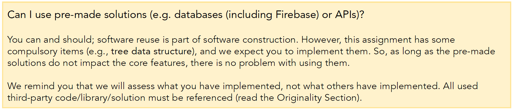

# Rick Astley

## Team Meeting 1 - Week 7 - 24/09/2022 (19:00-20:30)
**Absent:** None
 
**Lead/scribe:** Chenwei Niu

## Agreed Procedure

- Stand up procedure
- Discuss the problems that we faced or cannot resolve
- Decide what each member should be done before the next meeting
- Free talk
  - speak out your own ideas 
  - transfer your task to others if you cannot solve but another member can.
- Decide the next meeting time

## Problems we discussed in details
- We re-discussed the topic of my marketplace, and we finalized to make a used car app.

- We decided our common goal to get HD on this project, which means we need to do at least 10 general features and implement them in quality

- We carefully re-read the instruction pdf, and found questions we were confused about. We will ask the tutor at next week's workshop
  1. How can we implement a tree structure if we use firebase as database? There are SQL statements to be called directly, and the tree structure is implicitly built into the database. We couldn't figure out other places to implement tree structure.
  
     
  
  2. Should 2,500 pieces of data be real data or we can make up our own data.
  
- How to resolve the conflict in repository (develop in own branch, merge to the main branch each time a small completed module that passes unit tests)

- How many easy/medium/hard features are required to implement?

- We decided to use Singleton/Observer/Factory patterns in this project.

## Agenda Items
| Number | Item |
| :--- | ---: |
| 1 | Group grade goal |
| 2 | Problems in project to ask tutor |
| 3 | Features to be finished before next Sunday |
| 4 | Design pattern to be used |

## Meeting Minutes
- stand up `5min`
- problems we faced `30min`
- tasks to be done `40min`
- Free talk `30min`
- Decide the next meeting time `5min`

## TODO Items
| Task | Assignee |
| :--- | ---: |
| Ask tutor the problem    | Chenwei Niu |
| Implement basic features | All members |

## Scribe Rotation
The following dictates who will be scribe in this and the next meeting.
| Name |
| :---: |
| Chenwei Niu |
| Canxuan Gang |
| Zice Yan |
| Xinyu Wu |