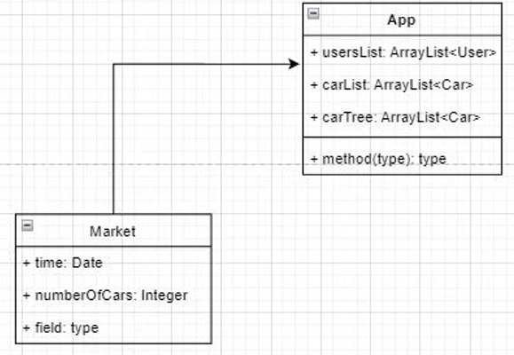
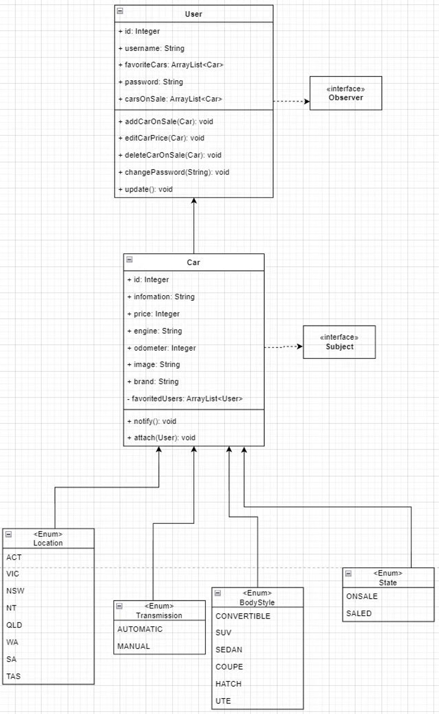
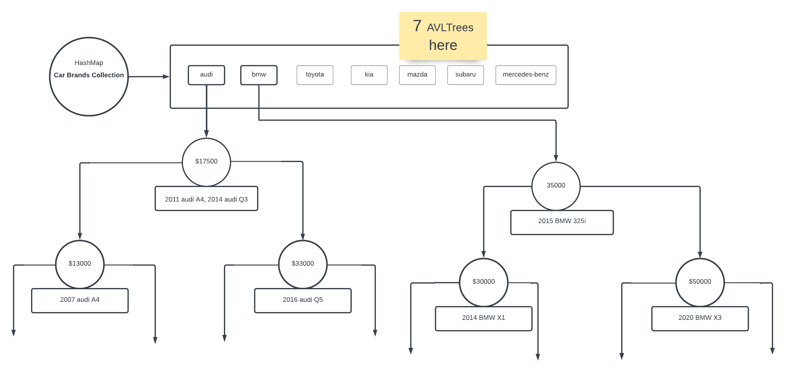
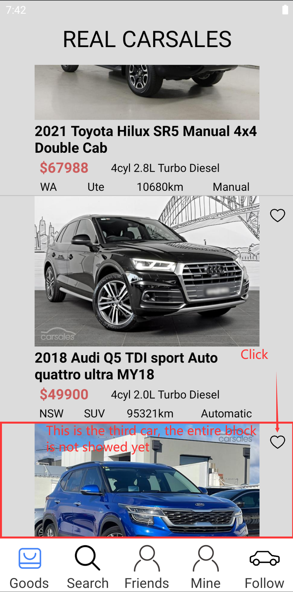
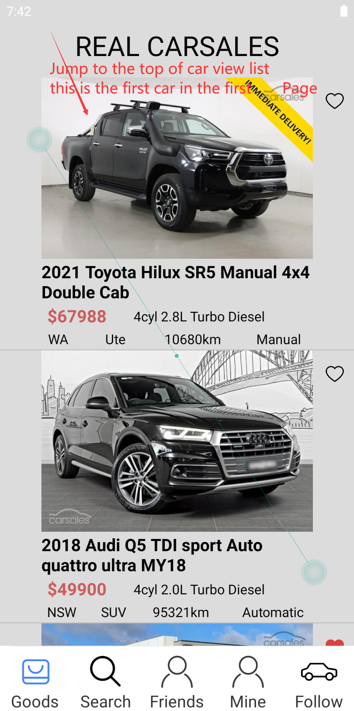

# [RickAstley] Report

The following is a report template to help your team successfully provide all the details necessary for your report in a structured and organised manner. Please give a straightforward and concise report that best demonstrates your project. Note that a good report will give a better impression of your project to the reviewers.

*Here are some tips to write a good report:*

* *Try to summarise and list the `bullet points` of your project as many as possible rather than give long, tedious paragraphs that mix up everything together.*

* *Try to create `diagrams` instead of text descriptions, which are more straightforward and explanatory.*

* *Try to make your report `well structured`, which is easier for the reviewers to capture the necessary information.*

*We give instructions enclosed in square brackets [...] and examples for each sections to demonstrate what are expected for your project report.*

*Please remove the instructions or examples in `italic` in your final report.*

## Table of Contents

1. [Team Members and Roles](#team-members-and-roles)
2. [Summary of Individual Contributions](#summary-of-individual-contributions)
3. [Conflict Resolution Protocol](#conflict-resolution-protocol)
4. [Application Description](#application-description)
5. [Application UML](#application-uml)
6. [Application Design and Decisions](#application-design-and-decisions)
7. [Summary of Known Errors and Bugs](#summary-of-known-errors-and-bugs)
8. [Testing Summary](#testing-summary)
9. [Implemented Features](#implemented-features)
10. [Team Meetings](#team-meetings)

## Team Members and Roles

| UID | Name | Role |
| :--- | :----: | ---: |
| u7377070 | Chenwei Niu | Leader;Trouble_shooter |
| u7389455 | Zice Yan | Designer |
| u6441152 | Xinyu Wu | Doer |
| u6557983 | Canxuan Gang | Supporter |

## Summary of Individual Contributions

*[Summarise the contributions made by each member to the project, e.g. code implementation, code design, UI design, report writing, etc.]*

*[Code Implementation. Which features did you implement? Which classes or methods was each member involved in? Provide an approximate proportion in pecentage of the contribution of each member to the whole code implementation, e.g. 30%.]*

*Here is an example:*

*UID1, Name1, I contribute 30% of the code. Here are my contributions:*
* A.class
* B.class: function1(), function2(), ...
* ....

*you should ALSO provide links to the specified classes and/or functions*

*[Code Design. What design patterns, data structures, did the involved member propose?]*

*[UI Design. Specify what design did the involved member propose? What tools were used for the design?]*

*[Report Writing. Which part of the report did the involved member write?]*

*[Slide preparation. Were you responsible for the slides?]*

*[Miscellaneous contributions. You are welcome to provide anything that you consider as a contribution to the project or team.]*


- #### **u7377070, Chenwei Niu**

  **Code Implementation**: I contribute 35% of the code implementation. Here are my contributions:

  - entire package [com.example.buy.parser](../Buy/app/src/main/java/com/example/buy/parser)
  - entire package [com.example.buy.view](../Buy/app/src/main/java/com/example/buy/view)
  - [BuyFragment.class](../Buy/app/src/main/java/com/example/buy/fragment/BugFragment.java), [SearchFragment.class](../Buy/app/src/main/java/com/example/buy/fragment/SearchFragment.java),[Car.class](../Buy/app/src/main/java/com/example/buy/entity/Car.java), [Market.class](../Buy/app/src/main/java/com/example/buy/entity/Market.java)
  - [UploadCarActivity.class](../Buy/app/src/main/java/com/example/buy/activity/UploadCarActivity.java),[KeyBoardUtils.class](../Buy/app/src/main/java/com/example/buy/utils/KeyBoardUtils.java)
  - [AVLTree.class](../Buy/app/src/main/java/com/example/buy/avltree/AvlTree.java)`:preOrderTraverse(), findLessOrEqualThan(),findLessThan(),findGreaterOrEqualThan(),find()`

  

  **Code Design**: I proposed Iterator pattern,  Singleton pattern, Observer pattern, factory pattern and DAO pattern.

  Finally, we decided to use the three pattern **Iterator pattern**,  **Singleton pattern **and **DAO pattern**.

  

  **UI design**:  I proposed use minimalist style as out UI design. Mainly use white, grey, black and blue to build the app.

  

  **Report Writing:** I am obligated to write the details of search feature, and a part of application design and decision

  

  **Miscellaneous contributions**: I wrote a spider to get real car data from www.carsales.com

  

- #### **u7389455 Zice Yan**
 **Code Implementation**: I contribute 25% of the code implementation. Here are my contributions:

  - entire package [com.example.buy.adapter](../Buy/app/src/main/java/com/example/buy/adapter)
  - entire package [com.example.buy.application](../Buy/app/src/main/java/com/example/buy/application)  
  - entire package [com.example.buy.sqliteDAO](../Buy/app/src/main/java/com/example/buy/sqlite)

  - [Minefragment.class](../Buy/app/src/main/java/com/example/buy/fragment/MineFragment.java), [FriendFragment.class](../Buy/app/src/main/java/com/example/buy/fragment/FriendFragment.java),[User.class](../Buy/app/src/main/java/com/example/buy/entity/User.java), [State.class](../Buy/app/src/main/java/com/example/buy/entity/State.java) , [Message.class](../Buy/app/src/main/java/com/example/buy/entity/Message.java)

  - [RegisterActivity.class](../Buy/app/src/main/java/com/example/buy/activity/RegisterActivity.java),[Utils.class](../Buy/app/src/main/java/com/example/buy/utils/Utils.java),[LoginActivity.class](../Buy/app/src/main/java/com/example/buy/activity/LoginActivity.java),[EditMemberInfoActivity.class](../Buy/app/src/main/java/com/example/buy/activity/EditMemberInfoActivty.java)
	
  - [MessageActivity.class](../Buy/app/src/main/java/com/example/buy/activity/MessageActivtiy.class )
  - [SearchFriendActivity.class](../Buy/app/src/main/java/com/example/buy/activity/SearchFriendActivtiy.class )


  **UI design**:  I decided on the UI for most of the program and finished it. Our program uses a commercially available one, with the top displaying the content and the navi bar below allowing us to jump to the corresponding position. Therefore, I propose to use a fragment to jump from one main page to another.

  

  **Report Writing:** I was responsible for the UI section of the report, and about login register part of storing data, peer to peer message.


- #### **u6557983, Canxuan Gang**
    **Code Implementation**: I contribute 20% of the code implementation. Here are my contributions:

  - [Car.class](../Buy/app/src/main/java/com/example/buy/entity/Car.java)---(Announcement: Participated in only part of the modification, main work is still implemented by Chenwei Niu)

  - [User.class](../Buy/app/src/main/java/com/example/buy/entity/User.java)---(Announcement: Participated in only part of the modification, main work is still implemented by Chenwei Niu)

  - [FollowFragment.class](../Buy/app/src/main/java/com/example/buy/fragment/FollowFragment.java)---(main work for project)

  - [CarViewAdapter.class](../Buy/app/src/main/java/com/example/buy/view/CarViewAdapter.java)---(Announcement: Participated in only part of the modification, main work is still implemented by Chenwei Niu)

  **UI design**: For the UI design part, I participated in a very small part, I made a "follow" button, that user can click this button to view the list of followed vehicles during the search.

  **Report Writing**: For this project, I craete a "follow" function in our APP, where users are able to follow a car and notified some events if there are any changes such as removed and add new cars. I construct this functionality based on 
Observer Pattern, where users are the subscribers and cars are the subjects. For simplicity and convenience, I do not add extra interfaces to implement but directly to add functions in relevant classes. Besides, relevant classes have been modified and created to support this functionality.

  More Specifically:

  For Car.java, I edit the variable favouriteUserList to record followed users.
  [Car.class](../Buy/app/src/main/java/com/example/buy/entity/Car.java)

  For User.java, I added favouritaCars to mark the car current user followed and to subscribe it, which 
was later modified by my teammates, combining mentioned functions in Fragment.java.
  [User.class](../Buy/app/src/main/java/com/example/buy/entity/User.java)

  [FollowFragment.class](../Buy/app/src/main/java/com/example/buy/fragment/FollowFragment.java)
  For FollowFragment.java, I construct this corresponding to the page of follow items and complete its 
functionality.

  for CarViewAdapter.java, I modified it to better complete the car, which I first 
created a java class but later was modifed by my teammates to combine my methods 
in CarViewAdapter.java.following function based on Observe Pattern.
  [CarViewAdapter.class](../Buy/app/src/main/java/com/example/buy/view/CarViewAdapter.java)


- #### **Xinyu Wu**

  - 


## Conflict Resolution Protocol

*[Write a well defined protocol your team can use to handle conflicts. That is, if your group has problems, what is the procedure for reaching consensus or solving a problem?
(If you choose to make this an external document, link to it here)]*

- If a team member's weekly meeting assignment is not completed, we will reduce his contribution to the project and reassign the task.
- If any team member is unable to attend the weekly meeting due to special reasons, we will record the meeting screen and send it to him.
- If a team member is ill and unable to carry out the project, we will distribute his current task equally among the remaining members.
- If there is a conceptual conflict in the project design, we will vote within the group and implement the plan with the highest number of votes.
- In order to avoid any conflicts in the team, we will use group chat to communicate the task progress and difficulties in the project.
- When a group member has a technical problem, he can send the problem to our group chat platform, and everyone will give their own suggestions.
- When problems arise in the group, the team members should be active in solving them and can offer constructive criticism. The purpose of this is to offer frank and direct opinions to solve the problem, but also to support and point out the good work done by the team members.

[Please check the details in the last paragraph of meeting 1 record](meeting1.md)


## Application Description

"REAL CARSALES" is a used car trade application developed for people with used car purchase intent. It provides concrete information on existing used cars in stock across Australia for 7 car brands.  Users can browse used car information on the app, and search for vehicles based on brand, price, year, odometer and other conditions according to their own needs. Users can also bookmark their favourite cars. In addition to this, the app also provides an in-software chat function, enabling buyers and sellers to communicate, and car lovers to communicate with each other.


**Application Use Cases and or Examples**

*[Provide use cases and examples of people using your application. Who are the target users of your application? How do the users use your application?]*

Use case diagram:
 <br>

*Here is a pet training application example*

*Molly wants to inquiry about her cat, McPurr's recent troublesome behaviour*
1. *Molly notices that McPurr has been hostile since...*
2. *She makes a post about... with the tag...*
3. *Lachlan, a vet, writes a reply to Molly's post...*
4. ...
5. *Molly gives Lachlan's reply a 'tick' response*

*Here is a map navigation application example*

*Targets Users: Drivers*

* *Users can use it to navigate in order to reach the destinations.*
* *Users can learn the traffic conditions*
* ...

*Target Users: Those who want to find some good restaurants*

* *Users can find nearby restaurants and the application can give recommendations*
* ...

*List all the use cases in text descriptions or create use case diagrams. Please refer to https://www.visual-paradigm.com/guide/uml-unified-modeling-language/what-is-use-case-diagram/ for use case diagram.*

## Application UML

 <br>
 <br>
*[Replace the above with a class diagram. You can look at how we have linked an image here as an example of how you can do it too.]*

## Application Design and Decisions

#### **Data Structures**


*I used the following data structures in my project:*

1. ArrayList

   * Objective: It is used for storing Car View Objects for visualization feature, search feature, follow feature and delete feature

   * Locations: line 37 in BuyFragment.java, line 31 in FollowFragment.java, ..., etc.

   * Reasons:

     * It is resizable, ArrayList does not have a restrict length

     * We can directly access the item by index for the "adding favourite cars"feature

2. HashMap

   * Objective: It is used for storing AVLTrees for search feature

   * Locations: line 31 in Market.java

   * Reasons:

     * It is resizable
     * It can effectively search the value through key with a time complexity O(1) under ideal conditions, more efficient than array or List.

3. AVLTree

   * Objective: It is used for storing Cars for search feature. Each AVLTree is a car brand, and the key of each node is the car price.

     One node could have several cars having the same price as a list.

   * Locations: line 48 to line 54 in Market.java

   * Reasons:

     * AVLTree is balanced, so searching a node is always log(n), which is quicker than general Binary Search Tree in the worst situation. 
     * Although more rotations may be required to restore the balance after inserting or deleting node than the red-black tree, our application needs to ensure the efficiency of the search, we chose the AVL tree.
     * The advantage of B-tree is its small height, which is generally used for reading files on disk. The smaller tree height reduces the number of IOs, but we are looking up directly in memory, so the AVL tree is more efficient.
     * For potential used car buyers, car brand and price are at the first priority. Therefore, building seven brands AVLTrees using car price as key can optimize the user's search experience.

#### **Design Patterns**


1. Singleton Pattern

   * Objective: It is used for keeping Market.java and SQLiteDAOImpl.java have only one instance in the application

   * Locations: Market.java and SQLiteDAOImpl.java

   * Reasons:

     * Using singleton pattern would control the number of instance, saving the memory resources.
     * The market class contains cars List and AVLTrees, which the entire application needs to use. Using singleton makes sure that the entire application could access the same data.

2. Iterator Pattern 

   * Objective: It is used to keep the cars ArrayList in Market.java hided from external, external class can only access the cars data through an iterator

   * Locations: Market.java

   * Reasons:

     * The iterator pattern decouples algorithm from containers
     * The elements of private cars ArrayList should be accessed and traversed without exposing its representation (data structures).

3. Data Access Object Pattern

   * Objective: Encapsulate all database operations into DAOImpl class

   * Locations: SQLiteDAOImpl.java

   * Reasons:

     * The DAO pattern separates low-level data access APIs or operations from high-level activities or fragments.

       

#### **Grammar(s)**


A valid query contains at least 1 query attribute (case insensitive). Different attributes are separated by ";".   Our application not only supports searching for one certain car, but also supports searching for all cars that meet the criteria. 


Example:

```
brand=bmw;price>20000;odometer<15000
```


grammars:

```brand = {bmw/toyota/mercedes-benz/kia/mazda/audi/subaru}``` (e.g. brand = BMW) is to find all BMW cars.

``` price =/</>/<=/>= {INT}``` (e.g. price > 20000), finding all cars with price greater than 20000.

```odometer=/</>/<=/>= {INT}```  (e.g. odometer < 15000), finding all cars with odometer number less than 15000.

```location = {VIC/ACT/QLD/NSW/NT/SA/WA/TAS}``` (e.g. location = VIC), finding all cars located in Victoria state.

```bodystyle = {sedan/coupe/suv/ute/peoplemover/convertible/hatch/wagon}``` (e.g. bodystyle= suv), finding all SUV cars .

```transmission = {Automatic/Manual}``` (e.g. transmission = manual), finding all manual cars.

```year=/</>/<=/>= {INT}``` (e.g. year > 2019), finding all cars manufactured after 2019


The advantages of my design are:

- User friendly. The grammar is easy to learn, and it is case insensitive.
- Flexible. The sequence  of two query attributes is not sensitive. "brand=BMW;price>20000" is as same as "price>20000;brand=BMW"


#### **Tokenizer and Parsers**

*[Where do you use tokenisers and parsers? How are they built? What are the advantages of the designs?]*

I used tokenizer and parser in search functionality.    

Location:  [Tokenizer](../Buy/app/src/main/java/com/example/buy/parser/SearchTokenizer.java)    [Parser](../Buy/app/src/main/java/com/example/buy/parser/Parser.java)

**Tokenizer:**  

A token is constructed by a string and its ENUM type. SearchTokenizer implementing Tokenizer interface is used to tokenize the query typed in by users.

It contains methods current(), hasNext() and next(). hasNext() method checks whether the next token exists. next() method extracts the next token.

current() method returns the current Token. 

Tokens are separated by semicolon. next() read one token and check whether it is a valid token. If not, throw the IllegalTokenException.

If the token is valid, parser will parse it to corresponding Exp.class. After that, tokenizer will read the next token until the end of the input.


**Parser:**

Parser parses each token into corresponding Exp by method parseExp(), and store these Exp objects in an ArrayList called "query Attributes".  

parseExp() calls itself recursively, until all tokens are parsed into corresponding Exp. After that, parser is going to execute query by these Exp.

If ``BrandExp or PriceExp ``  are involved in these Exp, parser will search or traverse the AVLTrees. Otherwise, parser will traverse the cars ArrayList.


In the shown figure below, 

- if the query Attributes contain BrandExp, and brandExp.getBrand().equals("audi"). 

  The executeQuery() method will get the AVLTree of audi, and filter cars by other attributes like location, odometer, transmission and so on.

- if the query Attributes contain both BrandExp and priceExp (e.g. brand=audi;price>13000)

  Then, executeQuery() will perform a depth first search on audi's AVLTree to find the node whose price is <= 13000, then abandon all its

  left nodes in this query(), and store all satisfying nodes into a list. This algorithm also enhance the performance of search.

- if the query Attributes contain only priceExp (e.g. brand=audi,price>13000)

  Then, executeQuery() will perform a depth first search on each AVLTree to find the node whose price is <= 13000, then abandon all its

  left nodes in this query(), and store all satisfying nodes into a list. 





## Summary of Known Errors and Bugs

1. *Bug 1:*

- When clicking the exactly third car's Favourite-Vehicle button/Trash button in main/search/follow/mine page,

   there will be a jump towards the first car. 

  

  This is because each page can only display two and a half blocks of cars information, but user can still click the favourite button of the third car. Therefore, when the page is not scrolled down to see all the information of the third car, the system thinks the user is still in the first page, then when you click on the favourite of the third car, it will jump to the first top of the list.

  

  When all the information of the third vehicle is displayed, the system thinks that the user has scrolled down, and then there will be no bug if you click the favourite again.

  

  

## Testing Summary

*[What features have you tested? What is your testing coverage?]*

*Here is an example:*

- *Number of test cases: ...*

- *Code coverage: ...*

- *Types of tests created: ...*

*Please provide some screenshots of your testing summary, showing the achieved testing coverage. Feel free to provide further details on your tests.*

## Implemented Features


Feature Category: Search-related features<br>
*Implemented features:*

1. Feature 1: **Search functionality can handle partially valid and invalid search queries. (medium)**
   * Class [SearchTokenizer](../Buy/app/src/main/java/com/example/buy/parser/SearchTokenizer.java), method: next(), Lines of code: 58-159
   * Class [SearchFragment](../Buy/app/src/main/java/com/example/buy/fragment/SearchFragment.java), method: onClick(), Lines of code: 137-175<br>
2. Feature 2:**Sort a list of products returned from a search based on price, popularity, rating, availability, etc.**
   **(easy)**
   - Class [SearchFragment](../Buy/app/src/main/java/com/example/buy/fragment/SearchFragment.java), method: onViewCreated(), Lines of code: 83-133
     <br>


Feature Category: Greater Data Usage, Handling and Sophistication<br>
*Implemented features:*

3. Feature 3:**User profile activity containing a media file (image, animation (e.g. gif), video). (easy)**
   - 

4. Feature 4: **Deletion method of either a Red-Black Tree, AVL tree or B-Tree data structure. The deletion of nodes must serve a purpose within your application. (hard)**
   - Class [MineFragment](../Buy/app/src/main/java/com/example/buy/fragment/MineFragment.java), method:  dealWithEvent()   Lines of code: 139-148


Feature Category: Peer to Peer Messaging<br>
*Implemented features:*

5. Feature 5: **Provide users with the ability to message each other directly. (hard)**
   - 


Feature Category: User Interactivity<br>
*Implemented features:*

6. Feature 6: **The ability to ‘follow’ a store or item/product. There must be a section specifically dedicated to 'things' followed. [stored in-memory] (medium)**
   -  Class [BuyFragment](../Buy/app/src/main/java/com/example/buy/fragment/BuyFragment.java), method: onViewCreated(), dealWithEvent()   Lines of code: 59-79, 98-120
   -  Class [SearchFragment](../Buy/app/src/main/java/com/example/buy/fragment/SearchFragment.java), method:  onViewCreated(), dealWithEvent()   Lines of code: 74-80, 197-219
   -  Class [FollowFragment](../Buy/app/src/main/java/com/example/buy/fragment/SearchFragment.java), method:  onViewCreated(), dealWithEvent()   Lines of code: 42-100


## Team Meetings

*Here is an example (you could start numbering your meetings from 1):*

- *[Team Meeting 0](./meeting0.md)*
- ...

* Link to the minutes of your meetings as above. There must be at least 4 team meetings. 
Note that you must commit your minute meetings shortly after your meeting has taken place (e.g., within 24h), otherwise your meeting minute will not be accepted.
Uour meetings should also have a reasonable date span across Week 6 to 11.*

